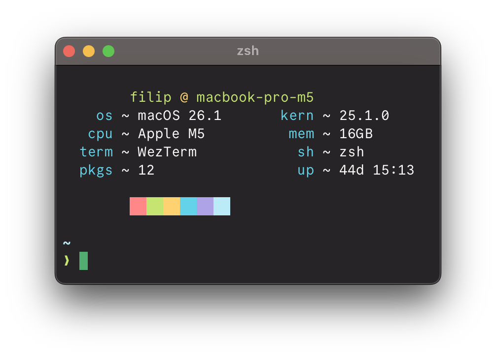

# macfet.sh

A fork of fet.sh, modified for macOS

Original `fet.sh` can be found @ [here](https://github.com/eepykate/fet.sh)

### Installing

Just copy `macfet.sh` somewhere and mark it as executable (`chmod +x macfet.sh`)
